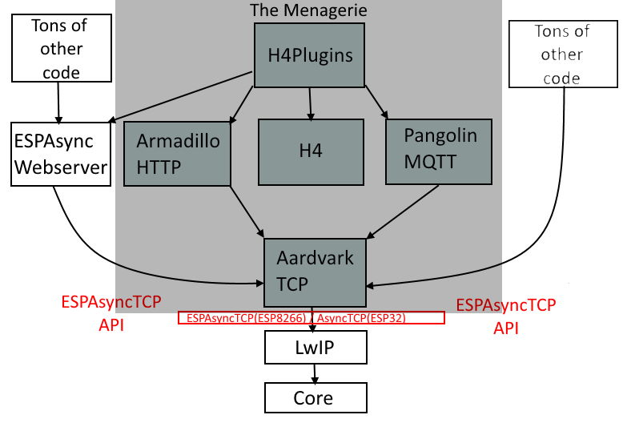

# ArduinoIDE Asynchronous TCP client library for ESP8266, ESP32

## Version 0.0.0

---

***This is not even "Alpha": you should only be here if you have been personally requested by me! It's just a placeholder until the final version is ready for release, so please, IGNORE IT!***

Current status: Pretty solid, perhaps a few edge / corner case left, but generally very close to "ready" (it was, after all, the working core of [PangolinMQTT](https://github.com/philbowles/PangolinMQTT))

TODO:
* Reintegrate with [PangolinMQTT](https://github.com/philbowles/PangolinMQTT). In theory its easy but its actually quite tricky as we have to add back in all the MQTT-specific low-level memory blocking in a way that preserves the now "neutral" protocol-agnostic memory management method.
* Full systematic re-test of *all* pangolin features especially the large packet stuff. (straightfoward long-winded tedium)
* wrap / encapsulate into an H4 "Plugin" (see [H4/Plugins](https://github.com/philbowles/h4plugins) ) ready for its next major release (quite tricky)
  
# What it will do when it's ready ("real soon now")

AardvarkTCP extends the popular [ESPAsyncTCP](blah) and [AsyncTCP] libraries. It adds *huge** packet fragmentation on transmit (TX), and reassembly of *huge** packets on receive (RX). It also fixes at least two fatal bugs in [ESPAsyncTCP](blah) which cause significant issue when trying to implement robust apps on top of that library. The full [ESPAsyncTCP](blah) API is provided, plus some extremely useful additions.

*By "huge" we mean any packet that is larger than the total LwIP buffers. If you compile with the "Low Memory" option this will be 1072 bytes or 2920 with the "Higher Bandwith" options (as of Apr 2021)

LwIP allows multiple buffers so what you see in the figures above is 1072=2x536 and 2920=2x1460. The important point here is that *all* of the values 536, 1460 (the individual LwIP buffer size) and 2 (the number of buffers) are implementation independent and *could* change in the future, so "hardcoding any of them into your own app if you needed to do your own fragmentation/reassembly routine would be a **bad idea** as it could cause problmes in the future or prevent you code running on newer / different machines.

AardvarkTCP solves that problem by allowing data up to 1/2 of the free heap to be sent / received, no matter what any of those LwIP "magic numbers" above are. It also provides a very simple interface which seamlessly manages both normal, unencrypted and TLS-encrypted sessions, depending on the URL provided.

---

# The "menagerie"

AardvarkTCP is the core driver of several other firmware packages for simple *robust* and rapid ***asynchronous*** IOT development on ESP8266 / ESP32

## The related libraries

|| Name | Provides | Notes |
| :---: | :----------  | :--- | :--- |
||[H4](https://github.com/philbowles/H4)|Scheduler/Async Timers| |
||[Forked ESPAsyncTCP](https://github.com/philbowles/ESPAsyncTCP-master)|"Glue" to LwIP| Important bugfixes |
||[Forked ESPAsyncWebserver](https://github.com/philbowles/ESPAsyncWebServer)| Basis of webUI in H4Plugins| Several major bugfixes |
||[AardvarkTCP](https://github.com/philbowles/AardvarkTCP)|Simple Large-payload Async TCP| API-compatible with ESPAsyncTCP, seamless TLS/SSL |
||[PangolinMQTT](https://github.com/philbowles/PangolinMQTT)|Async MQTT Client|QoS 0/1/2 Fully 3.1.1 compliant. Large payloads |
||[ArmadilloHTTP](https://github.com/philbowles/ArmadilloHTTP)|Async HTTP/S Client| Simple send/callback of large payloads |
||[H4/Plugins](https://github.com/philbowles/h4plugins)|Full Async IOT Firmware| Webserver, MQTT, OTA, NTP, HTTP etc etc |

---

# History / Origin

AardvarkTCP is in essence the blue portion of the following diagram, chopped out of [PangolinMQTT](https://github.com/philbowles/PangolinMQTT) so as a "core concept" is has been working well for quite a while
In that role it allowed for huge payloads (up to 1/2 the available Free Heap) to be sent and received over MQTT. It fragments the outgoing packets into message blocks small enough to fit whatever LwIP buffers your implementation has configured (without you having to worry or even know what they are) and acts a flow-control manager to synchronise the real-time to-ing, fro-ing and ACK-ing of Asynchronous TCP in the background. It does the reverse for huge incoming messages, which can only arrive - by definition - one LwIP buffer-full at a time. It then reassembles all the fragments into one huge packet and passes it to the MQTT protocol analyser.

No other library known to the author for ESP8266 / ESP32 can do this for MQTT and it does it seamlessly over TLS for HTTPS or unencrypted HTTP. From the user's point-of-view you just "send a large packet" or "receive a large packet" - *which is the way it should be!*

It is not much of a leap to realise tha the same functionality is ideal for asynchronous retrieval of web resources / APIs / REST services over HTTP/S. Yes, there are many examples of "reaching out" to remote servers e.g. Blynk or SOMEOTHEREXAMPLE, but the author knows of none that are fully asynchronous ***and*** that can safely and robustly handle 20-30kb pages as can [ArmadilloHTTP](). (The diagram below with "MQTT" crossed out and "HTTP" written in in crayon)

---

# Issues / Support

## IMPORTANT NOTE FOR PLATFORMIO USERS

Pangolin is an *Arduino library*, and is 100% compatible with the ArduinoIDE and its build system. PlatformIO, sadly, ***is not***. If PlatformIO has problems with code that compiles and runs correctly under ArduinoIDE, then it is a ***PlatformIO problem***, not an issue with this - or any other - valid Arduino library.

For this reason, I will not accept any issues relating to build problems with PlatformIO, nor any pull requests nor other suggestions which involve any changes that render this library less than 100% ArduinoIDE compatible.

## Non PlatformIO-related issues

Your **first** point of contact should be one of the facebook groups below, if only to let me know you have raised an issue here. Obviously I will check the issues from time to time, but I do no have the time to check every day.

If you want a rapid response, I am daily moderating those FB groups so you are likely to get a rapid response.

## Before submitting an issue

If you do not provide sufficient information for me to be able to replicate the problem, ***I CANNOT FIX IT***

So, always provide: the MCU/board type, a good description of the problem, how / when / why it happens and how to recreate it, as well as the full source code, relevant Serial output messages and a DECODED stack trace in the event of a crash.

## And finally...

This is open-source, I do it in my own time, for free. If you want professional-level support because you are using *my* work to benefit your own commercial gain, then I'm happy to talk privately about a paid support contract. Or you can support me on [Patreon](https://www.patreon.com/esparto) 

---

## Find me daily in these FB groups

* [Pangolin Support](https://www.facebook.com/groups/AardvarkTCP/)
* [ESP8266 & ESP32 Microcontrollers](https://www.facebook.com/groups/2125820374390340/)
* [ESP Developers](https://www.facebook.com/groups/ESP8266/)
* [H4/Plugins support](https://www.facebook.com/groups/h4plugins)

I am always grateful for any $upport on [Patreon](https://www.patreon.com/esparto) :)

(C) 2021 Phil Bowles