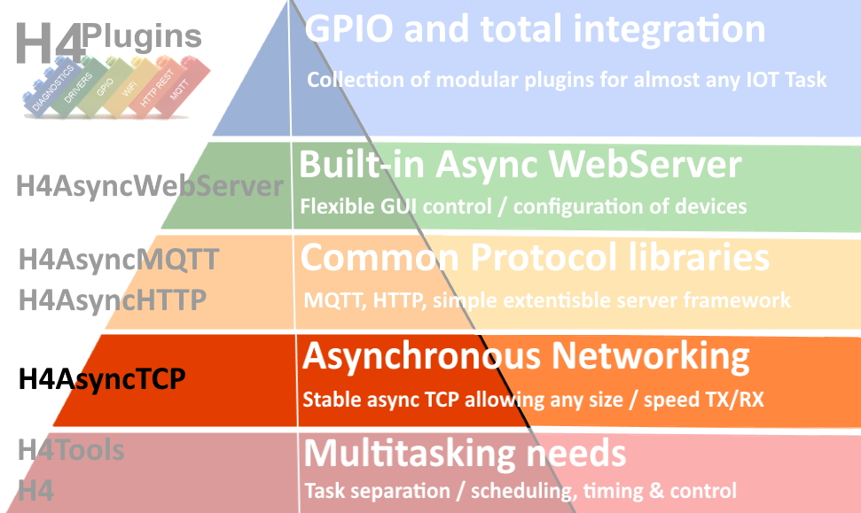
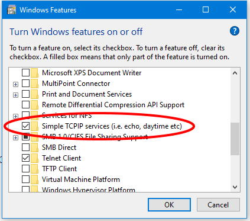

# H4AsyncTCP

## ArduinoIDE library: Asynchronous TCP Rx/Tx Client and abstract Asynchronous server

## Version 0.0.1 (13/10/2021) - Should be considered "ALPHA"

---

Licence:  Creative Commons: Attribution-NonCommercial-ShareAlike 4.0 International (CC BY-NC-SA 4.0) [Legal Text](https://creativecommons.org/licenses/by-nc-sa/4.0/legalcode)

# ***N.B. This licence expressly prohibits commercial use***

---

## If you are able, please [Support me on Patreon](https://patreon.com/esparto) and/or subscribe to my [Youtube channel (instructional videos)](https://www.youtube.com/channel/UCYi-Ko76_3p9hBUtleZRY6g)

---

# Contents

* [What does it do?](#what-does-it-do)
* [Where does it fit in "The IOT hierarchy of needs"?](#the-iot-hierarchy-of-needs)
* [Prerequisites](#prerequisites)
* [Installation](#installation)
* [Raising Issues](#raising-issues)
* [Known Problems](#known-problems)
* [API](#api)

---

# What does it do?

H4AsyncTCP provides two simple-to-use classes which handle all aspects of Asynchronous TCP Rx/Tx. While it *can* be used "standalone" by experienced coders, its main purpose is to function as the base of all other H4Async< xxx > libraries (see below).

---

# The "IOT Hierarchy of needs"


|| Name | Provides | Notes |
| :---: | :----------  | :--- | :--- |
||[H4](https://github.com/philbowles/H4)|Scheduler/Async Timers - core of all multitasking functions| |
||[H4Tools](https://github.com/philbowles/H4Tools)|'32/'8266 HAL and utility functions| |
||[H4AsyncTCP](https://github.com/philbowles/H4AsyncTCP)| Asynchronous TCP RX/TX| :point_left: *YOU ARE HERE*  |
||[H4AsyncMQTT](https://github.com/philbowles/H4AsyncMQTT)| Asynchronous MQTT c/w auto-reconnect and *full* QoS0/1/2 | |
||[H4AsyncHTTP](https://github.com/philbowles/H4AsyncHTTP)| Asynchronous remote GET / POST etc | |
||[H4AsyncWebServer](https://github.com/philbowles/H4AsyncWebServer)| Asynchronous Web Server + fast webSockets + SSE| |
||[H4Plugins](https://github.com/philbowles/H4Plugins)| Fully-featured IOT Apps multitasking framework| |

---

# Prerequisites

The library has been tested using the following firmware. Please do not even *think* about raising any issues unless you have the following correctly installed.

* [ESP8266 core 3.0.2](https://github.com/esp8266/Arduino)
* [ESP32 core 2.0.0](https://github.com/espressif/arduino-esp32)
* [ArduinoIDE 1.8.16](https://www.arduino.cc/en/software)

***N.B.***

Note that PlatformIO is not in the above list. Many folk *do* use it, but you will need to create your own installation configuration.
I am currently in discussions to add a PIO install to the standard [H4 Installer](https://github.com/philbowles/h4installer). If you are able to help / contribute to this, please get in touch!

---

# Installation

Soon* all H4 libraries will use the [H4 Installer](https://github.com/philbowles/h4installer). This ensures that all versions match and that other additional special functions are included e.g. Addition of optimised board definitions in H4Plugins...

...Until that's ready, install this library manually by downloading the zip file and using the ArduinoIDE to "add zip library". (Luckily, it has no extra tasks that would require the full H4 installer)

* = Don't ask :) 

---

# Raising Issues

## If you want a *quick* resolution, please follow these rules:

1. As with all H4xxx libraries, please make sure you have read *all* the relevant documentation relating to the issue and watched any videos on the [Youtube channel (instructional videos)](https://www.youtube.com/channel/UCYi-Ko76_3p9hBUtleZRY6g). Please also subscribe to the channel for notifications of news and updates.

2. If you still think there is a problem, then join the [Facebook H4  Support / Discussion](https://www.facebook.com/groups/444344099599131/) group and report the issue *briefly* there. This is because I visit the group every day, whereas I do not have time to visit dozens of github repos every day. Furthermore, it alerts other users to potential problems and allows a rapid initial assessment. 

3. If there is a genuine issue then you will be referred to [Raising H4/H4Plugins issues](https://github.com/philbowles/h4plugins/blob/master/docs/issues.md) after which you are advised to create a full github issue report.

4. Failing to make an initial report in the [Facebook H4  Support / Discussion](https://www.facebook.com/groups/444344099599131/) group and simply starting with a github issue, or failing to include all of the information required in [Raising H4/H4Plugins issues](https://github.com/philbowles/h4plugins/blob/master/docs/issues.md) is likely to result in a ***long*** delay before it gets picked up.

---

# Usage

## As a TCP client

The basic structure of your code will be:

* Instantiate `H4AsyncClient` object
* Declare event handlers for connect/disconnect/RX data/error
* Connect to remote server
* Synchronously TX some data...
* ...and/or asynchronously RX some data

#### Error handling:

`e` is the error and will be one of the values below.
`i` occasionaly provides additional infor for some errors.

```cpp
// Errors passed up directly from LwIP
  {ERR_OK,"No error, everything OK"},
  {ERR_MEM,"Out of memory error"}, // -1
  {ERR_BUF,"Buffer error"},
  {ERR_TIMEOUT,"Timeout"},
  {ERR_RTE,"Routing problem"},
  {ERR_INPROGRESS,"Operation in progress"}, // -5
  {ERR_VAL,"Illegal value"},
  {ERR_WOULDBLOCK,"Operation would block"},
  {ERR_USE,"Address in use"},
  {ERR_ALREADY,"Already connecting"},
  {ERR_ISCONN,"Conn already established"}, // -10
  {ERR_CONN,"Not connected"}, // -11
  {ERR_IF,"Low-level netif error"}, // -12
  {ERR_ABRT,"Connection aborted"}, // -13
  {ERR_RST,"Connection reset"}, // -14
  {ERR_CLSD,"Connection closed"},
  {ERR_ARG,"Illegal argument"},
// Errors generated by H4AsyncTCP itself
  {H4AT_ERR_DNS_FAIL,"DNS Fail"},
  {H4AT_ERR_DNS_NF,"Remote Host not found"},
  {H4AT_HEAP_LIMITER_ON,"Heap Limiter ON"},
  {H4AT_HEAP_LIMITER_OFF,"Heap Limiter OFF"},
  {H4AT_HEAP_LIMITER_LOST,"Heap Limiter: packet discarded"},
  {H4AT_INPUT_TOO_BIG,"Input exceeds safe heap"},
  {H4AT_CLOSING,"Client closing"},
  {H4AT_OUTPUT_TOO_BIG,"Output exceeds safe heap"}
```

*Your* handler function can decide whether the error is fatal or not: if it returns `true`, then the connection will be closed (if not already). If there is an actual closure then the `onDisconnect` event will fire, so be careful not to cause an infinite loop. 

In the early stages, it is best to always return true and have all errors close the connection.

## Running the example sketch

The main prerequisite of [Example sketch](examples/h4asyncCOMPARISON/h4asyncCOMPARISON.ino) is that there is an "Echo Server" somehwre on the network. The two easiest ways of achieving this are:

* Windows10 systems:

In control panel / programs / turn Windows features on or off, select "Simple TCPIP services..."



After reboot you will find an Echo server on port 7

* On any system having Python3 installed

Run the provided [Python Echo Server](src/echoserver.py) which listens on 8007

In all cases, edit the code of the sketch for the IP/Port of *your* echo server.

### How the sketch works

The sketch runs a series of tests in which a number of specifically-sized TCP packets are sent to the echo server at a chosen rate ("stagger" value in mS, default=0 i.e. immediately consecutive) and the amount of data echoed back is totalled up.

Where no data is lost / discarded the amount RXed will - of course - be the same as the total amount TXed and the test passes, otherwise it fails.

By changing the size, number and stagger value, you can estabish "safe" limits for your own system...

***WHEN `USE_ASYNC_CLIENT` IS SET TO 0***

If you set `USE_ASYNC_CLIENT` to 1, the sketch will compile using the ESPAsyncTCP and the tests will almost certainly fail!

Results of running the code against both libraries on both ESP8266 and ESP32 can be found [here](docs/testoutput32.txt)

---
## As a TCP Server

`H4AsyncServer` is highly abstract - it has only one non-virtual function `onError`.

To create your own server then you need to define virtual overrides for:

* `_instantiateRequest`

This is only required if you have subclassed `H4AsyncClient`. Here you instantiate your server handler object and return a pointer to its base `H4AsyncClient`. In most cases, the default `H4AsyncClient` will suffice

* `begin`
  Call the base class `begin` to set up incoming connection handling on the designated port, then do anything your own server needs during initialisation.

* `reset`
  Deallocate any open resources / handles / memory etc and set your class so that a subsequent call to `begin` will bring server to initial state as it would have done on 1st call.

* `route(void* c,const uint8_t* data,size_t len`
  This is the main "handler" for your server. `c` is a client* and will be `H4AsyncClient*` unless you have subclassed it in `_instantiateRequest`. `data` and `len` describe the raw data of the message that caused the incoming connection.

  Here you will analyse, parse, act upon the incoming message in whatever way defines your server and then reply to the incoming request with e.g. `c->TX(someReplyDataPointer,someReplyDataLength);`

See the fully-functional example below in the [Server API](#server-api) section

---

# API

## Client

### Client Callbacks

* `void cbConnect(void)`
* `void cbDisconnect(void)`
* `bool cbError(int e,int i)`
* `void rxFunction(const uint8_t* data, size_t len)`

### Client Methods

```cpp
void close(); // force immediate connection close
void connect(const std::string& host,uint16_t port);
void connect(IPAddress ip,uint16_t port);
void connect(const std::string& url); // e.g. http://insecure.remote.ru:12345/long/resource/path/?data=123&moredata=456" (see below)
bool connected(); // true if it is
std::string errorstring(int e); // if H4AT_DEBUG set, translates e into human-readable error
uint32_t localAddress();
IPAddress localIP();
std::string localIPstring();
uint16_t localPort();
size_t maxPacket(); // future use (see "known problems")
void nagle(bool b=true); // sets / unsets nagle algorithm on the connection
void onConnect(H4_FN_VOID cbConnect); // define onConnect event handler
void onDisconnect(H4_FN_VOID cbDisconnect); // define onDisconnect event handler
void onError(H4AT_FN_ERROR cbError); // define onError event handler
void onRX(H4AT_FN_RXDATA rxFunction); // define data receive handler
uint32_t remoteAddress();
IPAddress remoteIP();
std::string remoteIPstring();
uint16_t remotePort();
void TX(const uint8_t* d,size_t len,bool copy=true); // send data. If AND ONLY IF data is static, copy=false is more efficient
```

### URL defintion

The url must be specified in the following general form. The extended path and query portions are optional, as is the port. If the port is omitted it will default to 80 for URLs starting `http`

`http://hostname:port/path/to/resource?a=b&c=d"`

or

`https://hostname:port/path/to/resource?a=b&c=d"`

The `hostname` portion my be specified as a "dotted quad" IP address e.g. "172.103.22.14" or a publicly resolvable DNS name e.g. `somehost.co.uk`

ESP8266 targets will happily resolve `.local` names. See "Known Issues" re ESP32

#### Valid examples

* `http://192.168.1.15` // defaults to port 80
* `http://mosquitto.local:8883` // .local only works on ESP8266 at the moment
* `http://insecure.remote.ru:12345/long/resource/path/?data=123&moredata=456`

---
## Server

### Server Callbacks

* `void cbError(int e,int i)`

### Server Methods

```cpp
// Constructor
H4AsyncServer(uint16_t port);

// See "usage" above for descriptions
void begin();
void onError(H4AT_FN_ERROR f);
void reset();
void route(void* c,const uint8_t* data,size_t len)=0;

H4AsyncClient* _instantiateRequest(struct tcp_pcb *p);

```

### Fully-functional example

Since the server API has been described under [Usage](#as-a-tcp-server) above, the following code of a simple Echo server should "pull together" server creation and handling.

The server simply returns whatever it receives to the client, i.e. it echoes back the input

```cpp
class EchoServer: public H4AsyncServer {
  public:
    EchoServer(uint16_t port): H4AsyncServer(port){}
        void            route(void* c,const uint8_t* data,size_t len) override { 
          reinterpret_cast<H4AsyncClient*>(c)->TX(data,len);
        };
};
//
// which may then be instantiated as:
//
EchoServer echo(7); // listen on port 7 and echo any input
```

---

# Known Problems

* ESP32 version cannot resolve `.local` addresses so you will need to specify or resolve the IP address yourself.

* Heap protection is not yet implemented, so you are recommended to stay within size / speed limits as much as possible. There is a problem *somewhere* in that once the users goes beyond the "window size", certain combinations of TX / RX size, nagle on/off, network speed? cause some packets not to get ACKed by the remote server.

Hence until this is solved, one cannot safely determine the "max safe packet size" required for the heap protection mechanism. *[ I currently suspect LwIP - any help in this area would be most welcome! (and will almost certainly turn out to be H4 code of course... )]*

Until then, try to keep packets smaller than a SND_BUF on TX and WND on RX when sent slowly, with these values scaled back proportionately if sent in rapid bursts. Ideally the combination of size / speed should stay within the known "safe effective kB/s" - which has been determined during testing (but is almost certain to differ on *your* network)

| Platform | TCP_MSS | TCP_SND_BUF | TCP_WND | Safe kBpsEff |
| :--- | ---: | ---: | ---: | ---: |
| ESP32 | 1436 | 5744 | 5744 |425|
| ESP8266 Low Memory | 536 | 1072 | 2144 |150|
| ESP8266 High Bandwidth | 1460 | 2920 | 5840 |225|

***N.B.*** Once "the source of the lost ACK" has been found, you won't need to worry about any of the above as your code will either "just work" when within safe limits or cause an error (  `H4AT_INPUT_TOO_BIG` or `H4AT_OUTPUT_TOO_BIG`) if outside those limits.

---

(c) 2021 Phil Bowles h4plugins@gmail.com

* [Support me on Patreon](https://patreon.com/esparto)
* [Youtube channel (instructional videos)](https://www.youtube.com/channel/UCYi-Ko76_3p9hBUtleZRY6g)
* [Facebook H4  Support / Discussion](https://www.facebook.com/groups/444344099599131/)
* [Facebook General ESP8266 / ESP32](https://www.facebook.com/groups/2125820374390340/)
* [Facebook ESP8266 Programming Questions](https://www.facebook.com/groups/esp8266questions/)
* [Facebook ESP Developers (moderator)](https://www.facebook.com/groups/ESP8266/)