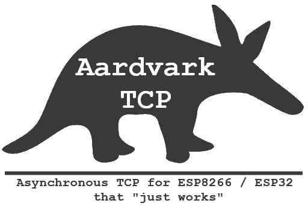
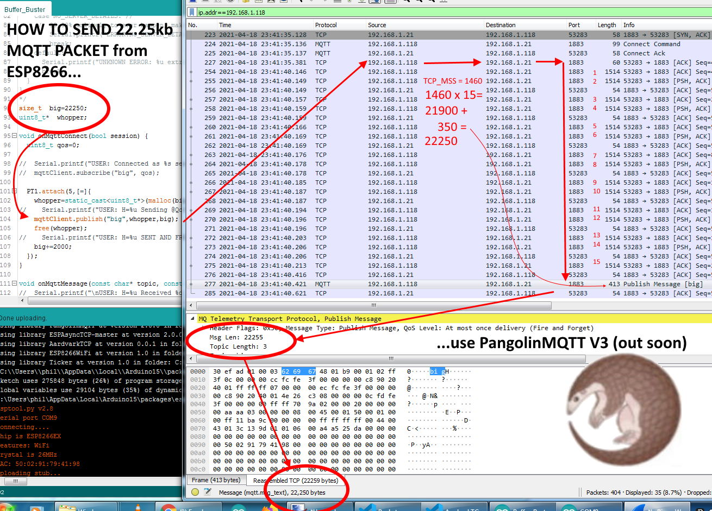
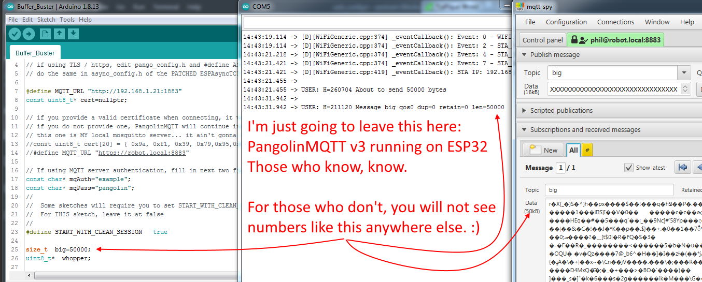
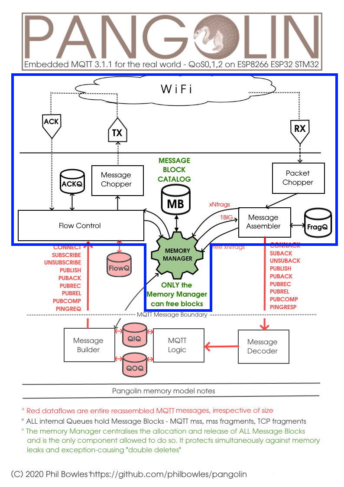

# ArduinoIDE Asynchronous TCP client library for ESP8266, ESP32

## Version 0.1.2 2/6/2021

Code tidying re std:: prefixing / namespace issues, API/functionality unchanged

## Version 0.1.1

---

# Contents

* [What does it do?](#what-does-it-do)
* [Worth 1000 words - the minimal API](#worth-1000-words)
* [Where AardvarkTCP fits in "The Menagerie"](#the-menagerie-roadmap)
* [API](#api)
* [Known Issues](#known-issues)
* [History / Origins](#history--origin)
* [Problems / Support](#issues--support)

# What does it do?

On its own, not a lot and to change that you need to be a reasonable C++ programmer. It is designed as an abstract base class and both [PangolinMQTT](https://github.com/philbowles/PangolinMQTT) and [ArmadilloHTTP](https://github.com/philbowles/ArmadilloHTTP) use it as their core Async TCP driver. So if you want to use either of those, (or [H4/Plugins](https://github.com/philbowles/h4plugins) which sits on top of them both) you will need it anyway, even if you are not going to write your own sub-class.

It's useful if you want to write your own Async protocol handler, as 90% of the hard bits have already been done for you. For example both the bugs and differences in the traditional ESPAsyncTCP (for ESP8266) and AsyncTCP (for ESP32) have been ironed out, so that there is a single common interface for all your Async TCP apps from now on. The whole process is reduced to:

* set up server URL
* set up RX function to receive data
* connect to server
* send some data

Where permitted by the calling library, TLS is available merely by using "https" in the server URL rather than "http". Be aware that TLS implementation is "cheap and cheerful" and only available on ESP8266. It will not connect with servers requiring advanced features such as client certificates, military-grade cipher suites etc.

One of the main benefits that that the pre-requisite forked versions of the Async Libraries ( [Forked AsyncTCP](https://github.com/philbowles/AsyncTCP-master) and [Forked ESPAsyncTCP](https://github.com/philbowles/ESPAsyncTCP-master) ) bring is *huge** packet fragmentation on transmit (TX), and reassembly of *huge** packets on receive (RX). 

It also fixes at least two fatal bugs in ESPAsyncTCP (for ESP8266) which cause significant issues when trying to implement robust apps on top of that library and adds missing features to AsyncTCP (for ESP32). It still exposes the entire "old-style" API from the broken original libraries, to ease porting of any exisiting code you may have. Having said that, once you see how easy it is to use, you will almost certainly dispense with any old-style calls.

*By "huge" we mean any packet that is larger than the total LwIP buffer space. For example on ESP8266, if you compile with the "Low Memory" option this will be 1072 bytes or 2920 with the "Higher Bandwith" options (at core 2.7.4)


LwIP allows multiple buffers so what you see in the figures above is 1072=2x536 and 2920=2x1460. The important point here is that *all* of the values 536, 1460 (the individual LwIP buffer size) and 2 (the number of buffers) are implementation-dependent and *could* change in the future, so "hardcoding" any of them into your own app would be a **bad idea** as it could cause problems in the future or prevent you code running on newer / different machines.

AardvarkTCP solves that problem by allowing data up to 1/2 of the free heap to be sent / received, irrespective of those LwIP "magic numbers". As an example, here it is running "underneath" [PangolinMQTT](https://github.com/philbowles/PangolinMQTT) on an ESP8266 and allowing that lib to send and receive a 22kb+(!) MQTT packet



On ESP32 this can grow to over 50kb



---
## Worth 1000 words:

Other than the ESPAsyncTCP/AsynTCP API which is exposed for compatibility should you need it (you won't!), the main AardvarkTCP API is:

```cpp
// callbacks
void    onTCPconnect(VARK_cbConnect callback);
void    onTCPdisconnect(VARK_cbDisconnect callback);
void    onTCPerror(VARK_cbError callback);
void    onTCPpoll(VARK_cbPoll callback);
// setup / connect / disconnect
void    TCPurl(const char* url,const uint8_t* fingerprint=nullptr);
void    TCPconnect();
void    TCPdisconnect(bool force = false);
// send / receive
void    rx(VARK_FN_RXDATA f);
void    txdata(const uint8_t* d,size_t len,bool copy=true);
// miscellaneous
size_t  getMaxPayloadSize();

```

Unless you need very special handling, most practical use cases boil down to:

* define rx function
* set URL, connect
* tx data

---

# The "menagerie" roadmap

AardvarkTCP is the core driver of several other firmware packages for simple *robust* and rapid ***asynchronous*** IOT development on ESP8266 / ESP32


## The related / dependent libraries

|| Name | Provides | Notes |
| :---: | :----------  | :--- | :--- |
||[Forked AsyncTCP](https://github.com/philbowles/AsyncTCP-master)|"Glue" to LwIP (ESP8266)| Important bugfixes |
||[Forked ESPAsyncTCP](https://github.com/philbowles/ESPAsyncTCP-master)|"Glue" to LwIP(ESP32)| Missing features added |
||[Forked ESPAsyncWebserver](https://github.com/philbowles/ESPAsyncWebServer)| Basis of webUI in H4Plugins| Several major bugfixes |
||[PMB Tools](https://github.com/philbowles/pmbtools)|'32/'8266 HAL and utility functions| |
||[AardvarkTCP](https://github.com/philbowles/AardvarkTCP)|Simple Large-payload Async TCP| API-compatible with ESPAsyncTCP, seamless TLS/SSL |
||[PangolinMQTT](https://github.com/philbowles/PangolinMQTT)|Async MQTT Client|QoS 0/1/2 Fully 3.1.1 compliant. Large payloads |
||[ArmadilloHTTP](https://github.com/philbowles/ArmadilloHTTP)|Async HTTP/S Client| Simple send/callback of large payloads |
||[H4](https://github.com/philbowles/H4)|Scheduler/Async Timers| |
||[H4/Plugins](https://github.com/philbowles/h4plugins)|Full Async IOT Firmware| Webserver, MQTT, OTA, NTP, HTTP etc etc |

---

# API

Since AardvarkTCP must be inherited from, all of the following methods are `protected`

The only public methods are the default constructor and the `dump` function (if VARK_DEBUG is set in vark_config.h)

```cpp
void    _causeError(int e,int i); // allows subclasses to use single base class error handler
void    _parseURL(const std::string& url);// insiders shortcut
size_t  getMaxPayloadSize(); // returns largest "safe" meesage that can be sent/rcvd
void    onTCPconnect(VARK_cbConnect callback); // <void(void)>
void    onTCPdisconnect(VARK_cbDisconnect callback); // <void(int8_t)> -ve values arise in TCP, +ve values generated by AardvarkTCP
void    onTCPerror(VARK_cbError callback); // <void(int e,int info)> see above. Info gives more details 
void    onTCPpoll(VARK_cbPoll callback); // <void(void)>
void    rx(VARK_FN_RXDATA f); // all received data comes here: <void(const uint8_t*,size_t)>;
void    TCPconnect(); // does what it says on the tin...
void    TCPdisconnect(bool force = false); // ...as does this
void    TCPurl(const char* url,const uint8_t* fingerprint=nullptr); // see below
void    txdata(mbx m); // internal use only
void    txdata(const uint8_t* d,size_t len,bool copy=true); // send data. Leave the default to true.

```

[Example sketch](examples/inherit/inherit.ino)

## URL defintion

The url must be specified in the following general form. The extended path and query portions are optional, as is the port. If the port is omitted it will default to 80 for URLs starting `http` and 443 for those starting `https`

`http://hostname:port/path/to/resource?a=b&c=d"`

or

`https://hostname:port/path/to/resource?a=b&c=d"`

The `hostname` portion my be specified as a "dotted quad" IP address e.g. "172.103.22.14" or a publicly resolvable DNS name e.g. `somehost.co.uk`

ESP8266 targets will happily resolve `.local` names. See "Known Issues" re ESP32

### Valid examples

* `http://192.168.1.15` // defaults to port 80
* `https://myremotehost.com/api?userid=123456` // default to port 443
* `https://mosquitto.local:8883` // .local only works on ESP8266 at the moment
* `http://insecure.remote.ru:12345/long/resource/path/?data=123&moredata=456`

### Using TLS

TLS is only currently only available on ESP8266 targets. The first step to using TLS is to edit the [`async_config.h`](https://github.com/philbowles/ESPAsyncTCP-master/blob/master/src/async_config.h) file in [Forked AsyncTCP](https://github.com/philbowles/AsyncTCP-master/scr) and change `#define ASYNC_TCP_SSL_ENABLED 0` to `#define ASYNC_TCP_SSL_ENABLED 1`

Note that this will significantly increase the size of the compiled app. Unless you absolutely need it, do not compile in TLS!

Note also that the version of TLS that ships with ESPAsyncTCP is very weak and there are many sites that will refuse to connect as they require stronger ciphers or client certificates etc.


### TODO

* Add `@username:password` basic auth scheme for e.g. [ArmadilloHTTP](https://github.com/philbowles/ArmadilloHTTP)


---

# Known Issues

* ESP32 version cannot resolve `.local` addresses so you will need to specify the IP address
* TLS very limited: only sites with very low requirements will allow connection
* Some sites that send chunked-encoding responses also send dditonal packets - this confuses the rebuiulding mechanism. 
  A better way needs to be found and will be fixed in a future release

---

# History / Origin

AardvarkTCP is in essence the blue portion of the following diagram, chopped out of [PangolinMQTT](https://github.com/philbowles/PangolinMQTT) so as a "core concept" it has been working well for quite a while.

In that role it allowed for huge payloads (up to 1/2 the available Free Heap) to be sent and received over MQTT. It fragments the outgoing packets into message blocks small enough to fit whatever LwIP buffers your implementation has configured (without you having to worry or even know what they are) and acts a flow-control manager to synchronise the real-time to-ing, fro-ing and ACK-ing of Asynchronous TCP in the background. It does the reverse for huge incoming messages, which can only arrive - by definition - one LwIP buffer-full at a time. It then reassembles all the fragments into one huge packet and passes it to the MQTT protocol analyser.

No other library known to the author for ESP8266 / ESP32 can do this for MQTT and it does it seamlessly over TLS for HTTPS(ESP8266 only) or unencrypted HTTP (ESP8266 and ESP32). From the user's point-of-view you just "send a large packet" or "receive a large packet" - *which is the way it should be!*

It is not much of a leap to realise that the same functionality is ideal for asynchronous retrieval of web resources / APIs / REST services over HTTP/S. Yes, there are many examples of "reaching out" to remote servers e.g. Blynk or Thingspeak etc, but the author knows of none that are fully asynchronous ***and*** that can safely and robustly handle 20-30kb pages as can [ArmadilloHTTP](https://github.com/philbowles/ArmadilloHTTP) - which you could visualise as the diagram below with "MQTT" crossed out and "HTTP" written in in crayon)



---

# Issues / Support

## IMPORTANT NOTE FOR PLATFORMIO USERS

ArdvarkTCP is an *ArduinoIDE library*, and is 100% compatible with the ArduinoIDE and its build system. PlatformIO, sadly, ***is not***. If PlatformIO has problems with code that compiles and runs correctly under ArduinoIDE, then it is a ***PlatformIO problem***, not an issue with this - or any other - valid Arduino library, so please contact *them*, not *me*.

For this reason, I will not accept any issues relating to build problems with PlatformIO, nor any pull requests nor other suggestions which involve any changes that render this library less than 100% ArduinoIDE compatible.

## Non PlatformIO-related issues

Your **first** point of contact should be one of the facebook groups below, if only to let me know you have raised an issue here. Obviously I will check the issues from time to time, but I do no have the time to check every day.

If you want a rapid response, I am daily moderating those FB groups so you are likely to get a rapid response.

## Before submitting an issue

If you do not provide sufficient information for me to be able to replicate the problem, ***I CANNOT FIX IT***

So, always provide: the MCU/board type, a good description of the problem, how / when / why it happens and how to recreate it, as well as the full source code, relevant Serial output messages and a DECODED stack trace in the event of a crash.

## And finally...

This is open-source, I do it in my own time, for free. If you want professional-level support because you are using *my* work to benefit your own commercial gain, then I'm happy to talk privately about a paid support contract. Or you can support me on [Patreon](https://www.patreon.com/esparto) 

---

## Find me daily in these FB groups

* [ESP8266 & ESP32 Microcontrollers](https://www.facebook.com/groups/2125820374390340/)
* [ESP Developers](https://www.facebook.com/groups/ESP8266/)
* [H4/Plugins support](https://www.facebook.com/groups/h4plugins)

I am always grateful for any $upport on [Patreon](https://www.patreon.com/esparto) :)


(C) 2021 Phil Bowles